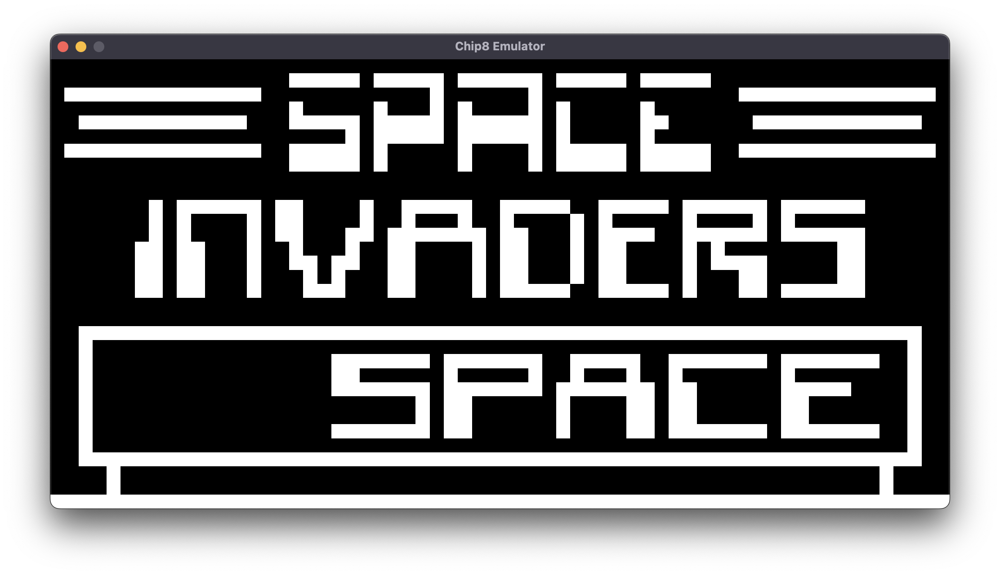
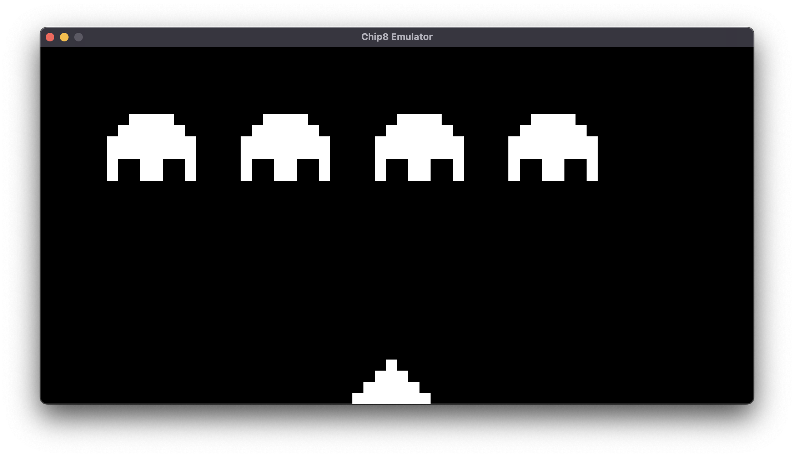

# chip8-emulator 


My own take on a very simple chip8 emulator, using rust and the wgpu project.


## Features

- Cross-platform
- Fast wgpu backend
- Working Keyboard & Audio


## Usage

Download any chip8 rom from the internet.
Eg. _space_invaders.ch8_:

```sh
cd chip8-emulator
cargo run -- space_invaders.ch8
```


### Keyboard

The following keys can be used to control the emulator:

```
|1|2|3|4|
|Q|W|E|R|
|A|S|D|F|
|Z|X|C|V|
```


## Resources

- [CHIP-8](https://en.wikipedia.org/wiki/CHIP-8)
- [wgpu](https://wgpu.rs)


## TODO's

-  Implement multithreading to reduce lag.
-  Implement pixel-art upscaling shader.
-  Refactor code.
-  Fix key polling.


## Screenshots



